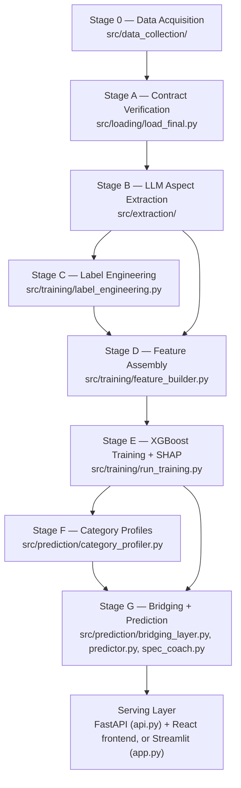

# Chapter 2 — Complete System Architecture

The system is not one script. It is **eight independently re-runnable stages**, each reading its inputs from disk and writing its outputs back to disk, plus a serving layer on top. "Independently re-runnable" is a real architectural decision, not a throwaway property — see [Chapter 7](07-design-decisions.md) for why it was made that way.

## 2.1 The full picture

Every box writes an artifact to disk before the next box runs. If you re-run any single stage, everything downstream of it can pick up the new artifact without re-running the (expensive, slow, or rate-limited) stages before it.

---

## 2.2 Stage 0 — Data Acquisition

**Files:** `src/data_collection/{amazon_collect_reviews,amazon_select_products,category_rules,clean_and_build,hf_stream,play_collect,reddit_collect}.py`

| | |
|---|---|
| **Purpose** | Turn public raw sources into a single, contract-conformant dataset the rest of the pipeline can trust blindly. |
| **Inputs** | Amazon Reviews 2023 (via Hugging Face streaming, `hf_stream.py`), Google Play scraping (`play_collect.py`), Reddit via the Arctic Shift archive (`reddit_collect.py`). |
| **Outputs** | `data/final/{products_physical,products_app,reviews_physical,reviews_app,reddit_context,manifest}.json` |
| **What happens internally** | `amazon_select_products.py` filters down to 6 physical categories using rules in `category_rules.py`; `amazon_collect_reviews.py` pulls their reviews; `clean_and_build.py` cleans text (English, 10–400 words), normalizes timestamps, enforces the ≥5-reviews-per-product floor, and writes the final JSON files plus a `manifest.json` that records `validation_passed`. |
| **Why it exists** | Nothing downstream can be trusted if the input data is inconsistent, contains non-English text, mixes timestamp formats, or includes products with too few reviews to model. This stage is where that mess gets absorbed once, instead of every downstream script re-checking it. |
| **Why it's first** | Everything else assumes typed, validated, English-only, deduplicated data. There is nothing to extract, label, or train on before this exists. |
| **If removed** | Nothing else in the pipeline could run — every later stage's very first line reads from `data/final/`. |
| **Real scale produced** | 740 physical products / 382 app products collected; after the Stage C fraud filter, 732 physical / 319 app products actually enter training. 62,462 physical reviews + 72,230+ app reviews (74,000+ combined were LLM-extracted). |

## 2.3 Stage A — Contract Verification

**File:** `src/loading/load_final.py`

| | |
|---|---|
| **Purpose** | A single gate: refuse to run anything further if the data doesn't conform to the frozen data contract. |
| **Inputs** | `data/final/*.json` |
| **Outputs** | Typed in-memory objects (pydantic/dataclasses) used by every later Python stage; or a hard failure naming the exact broken field. |
| **What happens internally** | Reads `manifest.json`, asserts `validation_passed == true`, checks every review's `product_uid` resolves to a real product, checks rating bounds, checks timestamp types. |
| **Why it exists** | Every stage after this one assumes the data is clean and *never re-checks it*. That assumption is only safe because this one gate enforces it centrally. Without a single enforced contract, every downstream script would need its own defensive validation, which is both slower and easier to get subtly wrong in one place and not another. |
| **Why it comes right after acquisition** | It's the last point at which a data problem is cheap to catch — before days of paid LLM extraction calls are spent on bad rows. |
| **If removed** | A malformed `data/final/` would silently corrupt every downstream artifact (mislabeled products, extraction on the wrong review text) with no clear error message pointing at the cause. |

## 2.4 Stage B — LLM Aspect Extraction

**Files:** `src/extraction/{llm_provider,extraction_prompt,batch_extractor,validators,review_extraction_sample}.py`

| | |
|---|---|
| **Purpose** | Convert unstructured review text into structured, per-aspect sentiment scores. |
| **Inputs** | `data/final/reviews_{physical,app}.json` |
| **Outputs** | `data/extracted/aspect_scores.jsonl` — one row per (review, aspect-set) with scores, evidence phrases, confidence, model used, latency. |
| **What happens internally** | For each review, calls an LLM with the **null-forcing prompt** (see [Chapter 7](07-design-decisions.md)): score an aspect 0–10 *only* if the review explicitly discusses it, otherwise return `null`; every non-null score needs a verbatim evidence phrase. Output is validated against a pydantic schema; invalid JSON retries once, then fails over to the next provider in the pool (Gemini Flash → Groq Llama-3.3-70B → local Ollama), then logs and skips after a third failure. Every result is appended to the `.jsonl` file immediately, so the process can crash and resume without redoing completed reviews. |
| **Why it exists** | This is the project's core measurement instrument: it turns 74,000+ free-text reviews into a numeric, per-aspect signal that a model can actually learn from. |
| **Why it comes before labeling/features** | Both later stages consume `aspect_scores.jsonl` directly — there is nothing to aggregate or featurize before it exists. |
| **If removed** | There would be no aspect-level signal at all — the model would be reduced to metadata only (price, rating, review count), which is exactly the "full model" leakage variant the paper explicitly distinguishes from the honest "aspects-only" result (see [Chapter 5](05-model-development.md)). |

## 2.5 Stage C — Label Engineering

**File:** `src/training/label_engineering.py`

| | |
|---|---|
| **Purpose** | Compute the regression target — a `success_score` per product — from real, later-observed market behavior, and flag products whose review history looks manipulated. |
| **Inputs** | `data/final/products_*.json`, `data/final/reviews_*.json` |
| **Outputs** | `data/extracted/labels.json`: `{product_uid: {success_score, components, suspect_reviews, category, product_type}}` |
| **What happens internally** | Computes `velocity = review_count / months_active`, then for physical products `success = 100·(0.40·volume_norm + 0.35·rating_norm + 0.25·velocity_norm)`; for apps, adds an install-count and retention-proxy term (see formula in [Chapter 4](04-data-pipeline.md)). Everything is normalized **within category** — a kitchen appliance and a smartphone are not judged on the same scale. It also runs the fraud filter (burst-review windows, extreme-J rating shape, near-duplicate text) and marks 71 products `suspect_reviews: true`, excluding them from training. |
| **Why it exists** | The model needs something to predict. "Success" isn't handed to us by the data source — it has to be *defined*, and defined in a way that is fair across wildly different product categories and resistant to gamed review histories. |
| **Why it comes after extraction, before features** | The label doesn't depend on aspect scores at all (it's built purely from ratings/volume/velocity), but it's grouped into the same "training prep" phase because Stage D (features) needs both the labels and the aspect scores to build one training table. |
| **If removed** | There would be no target variable — XGBoost would have nothing to predict. |

## 2.6 Stage D — Feature Matrix Assembly

**File:** `src/training/feature_builder.py`

| | |
|---|---|
| **Purpose** | Turn per-review aspect scores into one row per product, in the exact column order both training and prediction will use forever after. |
| **Inputs** | `data/extracted/aspect_scores.jsonl`, `data/extracted/labels.json` |
| **Outputs** | `data/extracted/features_{physical,app}.parquet` **and** `models/xgb_{physical,app}_features.json` (the frozen, ordered column list). |
| **What happens internally** | For each aspect, computes the mean of non-null scores and a `mention_rate` (fraction of reviews that mentioned it at all) per product. If an aspect was never mentioned for a product, the feature is left as `NaN` — never imputed, because XGBoost handles missing values natively (see [Chapter 7](07-design-decisions.md)). Joins in the label, drops `suspect_reviews` products, writes the parquet files, and — critically — writes the **exact ordered column list** to a separate JSON manifest. |
| **Why it exists** | This is where the "feature space" of the model is literally defined. Getting the column order wrong here, or letting it silently drift between training and prediction, is the single most common way a real ML system breaks in production. |
| **Why it comes before training** | XGBoost needs a fixed-shape numeric table; this stage is that table's sole author. |
| **If removed / why the manifest matters** | The prediction code at serving time (Stage G) builds its input vector by *iterating the saved manifest file*, never by hardcoding column order anywhere else. So even a future code change to this stage automatically keeps training and serving in sync — the alternative (hardcoded column order in two places) is exactly the kind of bug that silently returns wrong predictions with no error. |

## 2.7 Stage E — XGBoost Training + SHAP

**File:** `src/training/run_training.py`

| | |
|---|---|
| **Purpose** | Learn the actual relationship between an aspect profile and real market success, per product type, and explain that relationship. |
| **Inputs** | `features_{physical,app}.parquet` |
| **Outputs** | `models/xgb_{physical,app}.json` (full model), `models/xgb_{physical,app}_aspects_only.json` (the honest, no-leakage variant), `models/shap_summary_*.png`, `models/training_report.json`. |
| **What happens internally** | 5-fold cross-validated gradient boosting (600 estimators, depth 5, seed 42) trains **two** variants per product type: a "full" model (all features including price/rating/rating-count) and an "aspects-only" model (LLM-derived features only, metadata stripped). SHAP's `TreeExplainer` produces global feature-importance plots; per-category R² is reported separately to catch a model that "only works for headphones." |
| **Why it exists** | This is the learning core of the whole system — the piece that actually turns "here's an aspect profile" into "here's a success estimate," and quantifies exactly how well that mapping works, honestly (see the full-vs-aspects-only split discussion in [Chapter 5](05-model-development.md)). |
| **Why it comes after features, before profiles/bridging** | Category profiles and the bridging layer both need a trained, saved model to score against. |
| **If removed** | There is no predictive model at all — extraction and labels would just sit as data with nothing learned from them. |

## 2.8 Stage F — Category Profiles

**File:** `src/prediction/category_profiler.py`

| | |
|---|---|
| **Purpose** | Summarize each category's real-world statistics into the grounding context the bridging LLM will reason against. |
| **Inputs** | `features_{physical,app}.parquet`, `aspect_scores.jsonl`, optionally `reddit_context.json` |
| **Outputs** | `data/extracted/category_profiles.json` |
| **What happens internally** | Per category: price quartiles, mean aspect scores + mention rates, the lowest-scoring aspects with real evidence phrases pulled from reviews ("pain points"), the highest-scoring ones with evidence ("strengths"), and — if Reddit data exists for that category — one LLM call summarizing community-stated buying priorities. |
| **Why it exists** | The bridging LLM (next stage) must never reason about a new product in a vacuum. This stage is what lets the prompt say "the category median price is $X, and here's a real customer complaint about durability" instead of relying on the LLM's untethered guesswork. |
| **Why it comes after training, before bridging** | It reads directly from the same feature table training used, so category statistics and the trained model are computed from the same underlying data. |
| **If removed** | The bridging layer would have nothing but the raw specification to reason from — no anchor to real category norms, no real evidence phrases to justify a score. This is exactly the failure mode the "anchor discipline" rule in the skeptic prompt is designed to prevent (see [Chapter 7](07-design-decisions.md)). |

## 2.9 Stage G — Bridging + Prediction

**Files:** `src/prediction/{bridging_layer,predictor,spec_coach}.py`

| | |
|---|---|
| **Purpose** | The whole point of the project: take a specification for a product that has never launched, and produce a viability estimate. |
| **Inputs** | User-supplied specification (name, price, description, category), `category_profiles.json`, the trained models, the feature manifests. |
| **Outputs** | A single JSON result: `viability_pct`, `aspects_only_pct`, `confidence`, `bridged_scores`, `top_risks`, `top_strengths`, market gaps, trust badges. |
| **What happens internally** | `bridging_layer.py` prompts an LLM, grounded in the category profile, to estimate the aspect profile the new product *would* earn after real customer use — under the skeptic rules (adjective blindness, absence rule, anchor discipline). `predictor.py` builds the feature vector by iterating the frozen manifest, scores it with both the full and aspects-only XGBoost models, runs SHAP on the aspects-only model to produce risk/strength explanations tied to design levers, and computes a percentile rank against retrospectively-bridged real products. `spec_coach.py` is a companion tool: for a user who hasn't written a full specification yet, it rates aspect coverage (covered/vague/missing) and asks at most 5 prioritized questions, without inventing facts the user never stated. |
| **Why it exists** | Everything before this stage was building the *capability* to do this; this stage is where that capability is actually applied to an unreleased product. |
| **Why it's last in the offline pipeline** | It depends on every artifact produced before it: the trained model, the feature manifest, and the category profiles. |
| **If removed** | The project would be "a validated methodology with no usable output" — all the training and validation work would exist, but nobody could actually get a prediction for their own product idea. |

## 2.10 The Serving Layer

**Files:** `src/app/api.py` (FastAPI backend) + `src/app/frontend/` (React 19 + Vite) — the primary interface — and `src/app/app.py` (a Streamlit alternative UI over the same prediction code).

| | |
|---|---|
| **Purpose** | Expose Stage G to an actual human user through a web interface, instead of a Python script. |
| **Inputs** | HTTP requests from the browser. |
| **Outputs** | Rendered dashboard: viability range, percentile rank, per-aspect chart against category averages, SHAP-based risks/strengths, market-gap report, spec coach panel, and a model-performance/analyzer view that renders `training_report.json` directly — including the app-track's `FAIL` badge, shown deliberately rather than hidden. |
| **What happens internally** | `api.py` exposes `/api/categories`, `/api/profile/{category}`, `/api/analyzer`, `/api/predict`, `/api/coach`. The React frontend (`src/app/frontend/src/`) has components `Navbar`, `SimulatorForm`, `PredictorResults`, `SpecCoachPanel`, `MarketGapsPanel`, `CustomCharts` that call those endpoints and render the result. FastAPI also mounts the compiled React build (`frontend/dist`) directly, so a single backend process serves both API and UI. |
| **Why it exists** | A judge, mentor, or real user needs to *use* the system, not read its JSON output. |
| **Why it's last** | It's a pure consumer of everything upstream — it has no ML logic of its own; it calls `Predictor` and `coach_spec` and renders what comes back. |
| **If removed** | The pipeline would still work end-to-end and could be driven from the command line / a notebook, but there would be no product to demo or hand to a non-technical stakeholder. |

## 2.11 How the pieces talk to each other — the key architectural guarantee

Three things make this pipeline resistant to the most common way ML systems silently break:

1. **Disk-persisted stage boundaries.** Nothing passes data between stages in memory only — everything lands as a file. That means any single stage can be re-run, inspected, or debugged in isolation.
2. **The feature manifest as the single source of truth for column order.** Training writes it once (Stage D); prediction reads it every time (Stage G). There is no second, hand-maintained copy of "what order do the features go in" anywhere in the code — see [Chapter 7](07-design-decisions.md) for why this specific decision was called out as important.
3. **The frozen aspect schema.** The 9 physical / 11 app aspect names are fixed from Stage B onward. If they ever changed after real extraction started, every downstream artifact (labels, features, trained models, category profiles) would silently misalign. This is why `CLAUDE.md` explicitly forbids changing it after extraction begins.
