::: IEEEkeywords
Product success prediction, aspect-based sentiment analysis, large
language models, gradient boosting, pre-launch analytics, electronic
word of mouth.
:::

# Introduction

enterprises evaluate prospective products with market-research
departments, paid consumer panels, and proprietary analytics. A small
business or independent maker enjoys none of this: the decision to
manufacture a wireless headphone or publish a mobile application is
routinely made on intuition, a competitor scan, and hope. The cost of
being wrong is not abstract---an unsold inventory run or a failed
development cycle can end a small firm---and the cost falls on consumers
too, who pay for products that break, disappoint, or were never matched
to their needs. Our motivation is to narrow this analytical gap: to give
businesses without access to powerful market-intelligence tooling an
evidence-based, affordable estimate of whether a product design is
likely to satisfy its market *before* money is committed to building it,
so that the products that do get built are more likely to be worth what
their users pay for them.

The obstacle is fundamental rather than incidental. Decades of work
relate online reviews and electronic word of mouth (e-WOM) to sales and
market outcomes (Chevalier and Mayzlin 2006; Dellarocas 2003;
Chintagunta et al. 2010; Luca 2016), and modern sentiment pipelines
extract remarkably fine-grained signals from review text (Zhang et al.
2023; Wang et al. 2025; Shan et al. 2025). But every such method
consumes *post-launch* data. At the moment the decision matters
most---before production---there are no reviews, no ratings, and no
sales. The only artifacts that exist are the product's specifications
and the accumulated experience of the category it will enter.

This paper asks whether that is enough. Our central idea is *aspect
bridging*: we first learn, from 74,000+ real reviews, how consumers in
each category score products along interpretable quality aspects (build
quality, ease of use, value for money, and so on) and how those aspect
profiles relate to eventual market success; we then employ a large
language model, prompted as a skeptical market analyst and grounded in
per-category statistics, to estimate the aspect profile that an *unseen*
product would earn---from its specifications alone. The estimated
profile is fed to the trained success model, yielding a launch-blind
viability estimate together with per-aspect explanations, measured trust
tiers, and explicit abstention when the specification offers too little
evidence.

Because a system intended for real financial decisions must be validated
with matching rigor, our primary contribution is methodological. We
evaluate launch-blind: real products are re-judged from only what was
knowable at their launch, and predictions are compared against the
market outcomes they subsequently earned. Crucially, after all design
iterations on a development set, we *pre-registered* a confirmatory
holdout---disjoint sample, frozen pipeline, pre-specified metrics---in
the spirit of the preregistration movement in empirical science (Nosek
et al. 2018). The contributions are:

- **C1.** A null-forcing aspect-extraction scheme over 74,000+ reviews
  in which an LLM may score an aspect only with verbatim textual
  evidence, never by inference, with typed validation and a crash-safe
  multi-provider pipeline (Section [4](#sec:method){reference-type="ref"
  reference="sec:method"}).

- **C2.** The bridging layer: a skeptic-prompted, category-grounded LLM
  estimator of aspect profiles from specifications, with absence
  penalties, grounding flags, and anchor discipline
  (Section [4](#sec:method){reference-type="ref"
  reference="sec:method"}).

- **C3.** A retrospective launch-blind validation harness and a
  pre-registered confirmatory holdout confirming a real,
  price-complementary signal: $\rho = 0.317$, CI $[0.06,0.54]$, AUC
  $=0.743$ (Section [5](#sec:validation){reference-type="ref"
  reference="sec:validation"}).

- **C4.** An honest map of scope: which aspects specifications can
  predict and which they cannot, and a five-target negative result
  showing the method fails for mobile applications
  (Section [6](#sec:negative){reference-type="ref"
  reference="sec:negative"}).

- **C5.** A measured, paired A/B evaluation of community-derived
  consumer priorities as bridging context
  (Section [7](#sec:reddit){reference-type="ref"
  reference="sec:reddit"}), and a deployed decision-support application
  whose interface surfaces the system's own measured limitations
  (Section [8](#sec:system){reference-type="ref"
  reference="sec:system"}).

# Related Work {#sec:related}

## Reviews, e-WOM, and Market Outcomes

That online opinion moves markets is well established. Chevalier and
Mayzlin showed review valence shifts book sales across retailers
(Chevalier and Mayzlin 2006); Dellarocas framed digitized word of mouth
as a new economic feedback mechanism (Dellarocas 2003); Chintagunta et
al. tied user reviews to box-office trajectories (Chintagunta et al.
2010); and Luca quantified revenue effects of Yelp ratings (Luca 2016).
Closer to our feature level, Archak et al. demonstrated that
*aspect-level* review content carries pricing power beyond star ratings
(Archak et al. 2011), and Ghose and Ipeirotis linked review text
characteristics to economic impact (Ghose and Ipeirotis 2011); Mudambi
and Schuff characterized what makes reviews informative (Mudambi and
Schuff 2010). Social-media signals have likewise been used to forecast
outcomes (Asur and Huberman 2010). All of these operate after launch.
The nearest antecedent to our goal is Narayanan et al.'s product
*pre-launch* prediction from resilient distributed e-WOM (Narayanan et
al. 2020), which forecasts reception from pre-release chatter about
announced products; our setting is strictly harder---we assume no
product-specific chatter exists at all, only specifications and category
history.

Review streams are also adversarial. Opinion spam has been studied since
Jindal and Liu (Jindal and Liu 2008), deceptive reviews can be
manufactured convincingly (Ott et al. 2011), and manipulation is
economically incentivized (Mayzlin et al. 2014); our corpus-level fraud
filter (Section [3](#sec:data){reference-type="ref"
reference="sec:data"}) follows this literature.

## Aspect-Based Sentiment Analysis

Aspect-based sentiment analysis (ABSA) began with frequency- and
lexicon-based aspect mining (Hu and Liu 2004; Liu 2012), was
standardized by the SemEval-2014 benchmark (Pontiki et al. 2014), and
has since been dominated by neural approaches, surveyed in (Zhang et al.
2023). Recent systems continue to refine the extraction machinery:
multi-feature fusion graph attention networks (Wang et al. 2025),
curriculum-learning hybrids (Lange et al. 2025), transformer pipelines
for bilingual e-commerce satisfaction (Shan et al. 2025), and
multi-source sentiment fusion ("Research on Sentiment Analysis Based on
Multi-Source Data Fusion" 2025). Our work differs in purpose rather than
machinery: we use ABSA not as an end task but as a *measurement
instrument*---converting unstructured reviews into a per-product aspect
profile that serves as the supervised-learning substrate---and we impose
a null-forcing, evidence-quoting discipline designed for downstream
trustworthiness rather than benchmark accuracy.

## LLMs as Extractors and Estimators

Transformer language models (Vaswani et al. 2017; Devlin et al. 2019),
scaled into instruction-following generalists ([Brown et al.]{.nocase}
2020; [Ouyang et al.]{.nocase} 2022; OpenAI 2023; Gemini Team, Google
2023; [Touvron et al.]{.nocase} 2023), now perform annotation
competitively with human crowds (Gilardi et al. 2023) and are
increasingly used as zero-shot components in e-commerce pipelines:
product classification (Roumeliotis et al. 2025), description generation
from reviews (Gutierrez et al. 2025), and numeric value prediction in
industrial systems (Hidayat et al. 2025). Reasoning-eliciting prompting
(Wei et al. 2022) and the broader foundation-model programme ([Bommasani
et al.]{.nocase} 2021) frame LLMs as general-purpose estimators. Our
bridging layer belongs to this line but adds two disciplines rarely
evaluated: adversarial-input skepticism (marketing copy is optimally
optimistic for flops and hits alike) and *launch-blind outcome
validation* of the LLM's estimates against subsequent market reality.

## Gradient Boosting for Tabular Prediction

For tabular product features, gradient-boosted trees (Friedman 2001;
Chen and Guestrin 2016; Ke et al. 2017) remain the strong default over
both classic ensembles (Breiman 2001) and neural alternatives, with
applications spanning e-commerce supply chains (Sayyad et al. 2024),
sentiment-augmented financial forecasting (Zhen et al. 2025; Shang
2025), and multi-criteria recommendation (Rakee et al. 2025). We use
XGBoost with native missing-value handling (unmentioned aspects remain
missing rather than imputed) and SHAP attributions (Lundberg and Lee
2017) to convert predictions into design-lever explanations. Our data
infrastructure builds on the Amazon reviews corpora (He and McAuley
2016; Hou et al. 2024) and the archived Reddit ecosystem (Baumgartner et
al. 2020); uncertainty is quantified by bootstrap (Efron 1979). Finally,
our insistence that the interface display model limits echoes recent
management-literature arguments that AI-assisted decisions require
calibrated human autonomy (Cristofaro and Bañón-Gomis 2026).

# Data {#sec:data}

We assembled a corpus spanning two market types. Physical products come
from the Amazon Reviews 2023 dataset (Hou et al. 2024) across six
categories (wireless headphones, Bluetooth speakers, smartphones,
smartwatches, power banks, kitchen appliances); mobile applications from
Google Play across four (finance, health & fitness, productivity,
education). Reviews were cleaned to English text of 10--400 words; every
product retained has at least five reviews; ratings lie in $[1,5]$ and
timestamps are normalized. After cleaning, the corpus contains 1,051
products (732 physical, 319 app) with over 74,000 reviews processed by
the extraction stage.

Because review streams are a gameable signal (Jindal and Liu 2008;
Mayzlin et al. 2014), we applied a fraud filter before label
construction: products where more than 40% of sampled reviews fall
inside a single 14-day window, whose rating distribution is
extreme-J-shaped, or where more than 30% of reviews are near-duplicates
(Jaccard $> 0.7$ on word sets) were flagged; 71 products were excluded
from training on this basis.

The regression target is a within-category composite. For physical
products:
$\text{success} = 100\,(0.40\,\text{volume} + 0.35\,\text{rating} + 0.25\,\text{velocity})$,
each component min--max normalized inside its category, with $\log(1+x)$
applied to heavy-tailed counts. Apps add install counts and a retention
proxy (rating count / install count). Normalizing within category is
essential---500 reviews means something different for a kitchen
appliance than for a smartphone.

**Survivorship disclosure.** The five-review floor means products that
launched and attracted no attention at all are structurally absent.
Every claim in this paper therefore concerns ranking among products that
reached the market's attention; "flop" means the bottom success quintile
of these survivors, not products nobody bought.
Section [9](#sec:limitations){reference-type="ref"
reference="sec:limitations"} discusses the consequences.

Finally, for the exploratory study of
Section [7](#sec:reddit){reference-type="ref" reference="sec:reddit"} we
collected 1,089 buying-intent Reddit comments across all ten categories
through the Arctic Shift archive of Reddit (Baumgartner et al. 2020)
(threads with purchase-decision titles; comment score $\geq 5$; 10--400
words; near-duplicates removed). Coverage is uneven and disclosed: from
237 comments for health & fitness apps down to 18 for smartphones; no
per-category claims are made from this source.

# Method {#sec:method}

## Aspect Extraction

Each review is decomposed into aspect-level sentiment against a frozen
schema: six aspects shared across market types (value for money,
utility, ease of use, reliability, design appeal, after-sales), three
physical-only (build quality, durability, repairability), and five
app-only (performance, stability, ad experience, update support,
privacy/trust). The extraction prompt is deliberately *null-forcing*: an
aspect may be scored (0--10) only if the review explicitly discusses it,
every non-null score must be accompanied by a verbatim evidence phrase
copied from the review, and the reviewer's star rating is provided as
context but forbidden as a score source. A review praising only sound
quality yields nulls for durability---silence is data we refuse to
fabricate. Outputs are validated with typed schemas; invalid responses
are retried once with the error appended, then failed over to the next
provider, and after a third failure the review is logged and skipped, so
no single bad response halts a multi-day batch. Extraction ran over
74,000+ reviews on a multi-provider pool (Gemini Flash, Groq
Llama-3.3-70B, local fallback) with per-key rate tracking, append-only
crash-safe logging, and resume support. Before the full batch, a
30-review hand-validation gate verified nulls for unmentioned aspects
and evidence-phrase fidelity.

## Success Models and Algorithm Selection {#sec:models}

Product-level features aggregate the extraction stream: per-aspect mean
score and mention rate (aspects never mentioned remain missing---XGBoost
(Chen and Guestrin 2016) handles missingness natively, so no imputation
is invented), plus metadata (price, average rating, log rating count,
review velocity, category). We train gradient-boosted regressors (600
estimators, depth 5, learning rate 0.05, seed 42) under 5-fold
cross-validation and report two variants with very different epistemic
status. The *full* model reaches CV $R^2 = 0.893$ (physical), but its
target is 35% composed of the average rating it receives as a feature;
we disclose this leakage and treat the number as an upper bound on fit,
not evidence of insight. The *aspects-only* variant---metadata stripped,
LLM features only---reaches $R^2 = 0.567$ (physical), and every claim in
this paper uses it. The same variant for apps scores $R^2 = 0.101$, the
negative finding examined in
Section [6](#sec:negative){reference-type="ref"
reference="sec:negative"}.

**Why XGBoost.** The choice of learning algorithm is not assumed; we
benchmarked six algorithms on the identical aspects-only feature matrix
under the same 5-fold CV (seed 42, $n = 732$ physical products).
Table [1](#tab:algo){reference-type="ref" reference="tab:algo"} and
Fig. [1](#fig:algometrics){reference-type="ref"
reference="fig:algometrics"} report all metrics. XGBoost achieves the
highest $R^2$ (0.564), the lowest RMSE (11.4), the highest AUC-ROC for
top-vs-bottom quintile discrimination (0.983), and trains in
0.29 s---2.5$\times$ faster than Random Forest and 7$\times$ faster than
sklearn Gradient Boosting. The runner-up, sklearn Gradient Boosting
($R^2 = 0.549$), matches XGBoost's AUC but takes 7$\times$ longer due to
the lack of histogram-based splitting (Ke et al. 2017). Random Forest
(Breiman 2001) ($R^2 = 0.532$) and MLP ($R^2 = 0.490$) trail further;
SVR (Cortes and Vapnik 1995) ($R^2 = 0.421$) and Ridge Regression (Hoerl
and Kennard 1970) ($R^2 = 0.368$) confirm that nonlinear interactions
matter. These findings are consistent with recent large-scale benchmarks
showing tree ensembles outperform deep learning on typical tabular data
(Grinsztajn et al. 2022; Shwartz-Ziv and Armon 2022).

Beyond raw accuracy, three domain properties favor XGBoost for this
pipeline. First, *native missing-value handling*: aspect scores are
structurally missing when a review does not mention an aspect, and
XGBoost learns optimal split directions for missing entries without
imputation (Chen and Guestrin 2016)---Ridge and SVR require explicit
fill strategies that inject noise. Second, *native categorical support*:
the `category` feature (six product categories) is consumed directly via
the `enable_categorical` flag without one-hot encoding, preserving the
ordinal structure the histogram learner can exploit. Third, *SHAP
compatibility*: TreeExplainer (Lundberg and Lee 2017) provides exact,
polynomial-time Shapley values for tree ensembles, enabling the
per-prediction risk/strength explanations the application surfaces
(Section [8](#sec:system){reference-type="ref" reference="sec:system"});
kernel SHAP on an MLP or SVR is orders of magnitude slower and
approximate.

  Algorithm          $R^2$       RMSE       Acc.      Prec.       Rec.      Spec.        F1        AUC        MCC
  ---------------- ---------- ---------- ---------- ---------- ---------- ---------- ---------- ---------- ----------
  **XGBoost**       **.564**   **11.4**     .917       .914       .927       .907       .917     **.983**     .838
  Grad. Boosting      .549       11.6     **.933**   **.925**   **.947**   **.920**   **.934**     .983     **.870**
  Random Forest       .532       11.8       .920       .906       .940       .900       .922       .979       .843
  MLP                 .490       12.3       .917       .895     **.947**     .887       .919       .966       .837
  SVR (RBF)           .421       13.1       .890       .897       .887       .893       .889       .942       .785
  Ridge               .368       13.7       .833       .811       .880       .787       .840       .921       .678

  : Algorithm comparison on aspects-only features (physical products,
  $n=732$, 5-fold CV, seed 42). Classification metrics are computed on
  top-quintile vs. bottom-quintile products. Best value per metric in
  **bold**. {#tab:algo}

We report all standard evaluation measures: $R^2$ and RMSE for
regression quality; accuracy, precision, recall, specificity, F1-score,
AUC-ROC, and Matthews Correlation Coefficient (MCC) for the binary
classification task of distinguishing top-quintile products from
bottom-quintile ones. Accuracy measures overall correctness; precision
captures the fraction of predicted hits that are true hits; recall
(sensitivity) captures the fraction of true hits correctly identified;
specificity measures the fraction of true flops correctly identified; F1
is the harmonic mean of precision and recall; AUC-ROC measures ranking
quality across all thresholds; and MCC, which accounts for all four
confusion-matrix quadrants, is particularly informative for balanced
binary tasks.

Fig. [1](#fig:algometrics){reference-type="ref"
reference="fig:algometrics"} shows all seven metrics side by side.
XGBoost achieves the highest $R^2$ and AUC-ROC; Gradient Boosting edges
ahead on classification metrics (F1 = 0.934, MCC = 0.870) but at
$7\times$ the training cost. The aggregated confusion matrices
(Fig. [3](#fig:confmat){reference-type="ref" reference="fig:confmat"})
confirm the pattern: all tree ensembles achieve $>90\%$ accuracy
separating eventual hits from flops; Ridge Regression's 32 false
positives (10.7% of all predictions) make it the clear loser, while
XGBoost and Gradient Boosting both keep false negatives below 4%.

<figure id="fig:algometrics" data-latex-placement="!t">
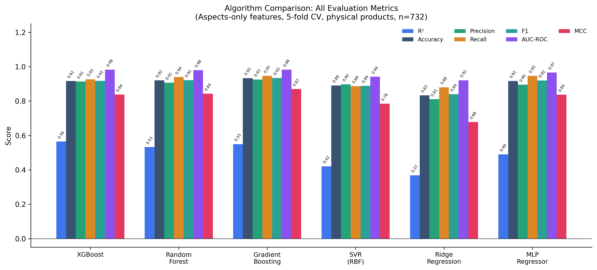
<figcaption>All evaluation metrics across six algorithms on the
aspects-only feature set (5-fold CV, <em>n</em> = 732). Metrics: <em>R</em>2, Accuracy, Precision,
Recall, F1, AUC-ROC, and MCC.</figcaption>
</figure>

<figure id="fig:algotradeoffs" data-latex-placement="!t">
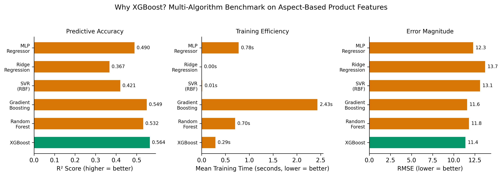
<figcaption>Three-panel accuracy–efficiency trade-off: predictive
accuracy (<em>R</em>2),
training time, and error magnitude (RMSE). XGBoost leads on accuracy and
error with competitive speed.</figcaption>
</figure>

<figure id="fig:confmat" data-latex-placement="!t">
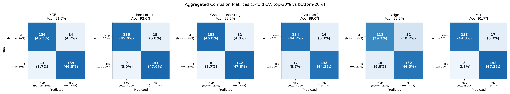
<figcaption>Aggregated confusion matrices (5-fold CV, top-20%
vs. bottom-20% products). Counts and percentages for each quadrant: true
negatives (flops correctly identified), false positives, false
negatives, and true positives (hits correctly identified).</figcaption>
</figure>

## Bridging: Estimating Aspects from Specifications

The bridging layer asks an LLM to estimate the aspect profile a product
*would* earn after months of real use, given only its specifications and
a category profile (price quartiles, mean aspect scores, top pain points
and strengths mined from real reviews, and optionally the community
priorities of Section [7](#sec:reddit){reference-type="ref"
reference="sec:reddit"}). Our first prompt trusted its input and failed
informatively: marketing copy is adversarially optimistic---flops and
hits are promoted with identical enthusiasm---and predictions compressed
into a narrow optimistic band. The production prompt (v2) is built on
three skeptic rules. *Adjective blindness*: only verifiable facts
(materials, standards, numbers, warranty terms) may justify scores;
"powerful bass" is noise, "50 mm drivers" is evidence. *Absence rule*:
if a spec offers no concrete evidence for an aspect, that silence is
itself a signal---competent teams state their strengths---so the aspect
is scored below the category mean and flagged ungrounded. *Anchor
discipline*: the category mean is what the median real product achieves;
any score more than two points above it requires a cited spec fact.
Section [5](#sec:validation){reference-type="ref"
reference="sec:validation"} quantifies the effect ($\rho$
$0.241 \to 0.313$, AUC $0.653 \to 0.761$;
Fig. [6](#fig:ablation){reference-type="ref" reference="fig:ablation"})
and rules out a verbosity confound by partial correlation.

## The Honesty Layer

Because bridged estimates vary in reliability by aspect, the system
surfaces its own measured validity. Each aspect carries a trust badge
derived from the retrospective validation
(Fig. [7](#fig:validity){reference-type="ref"
reference="fig:validity"}): STRONG (utility, ease of use, build
quality), MODERATE (value for money, reliability, durability), or NO
SIGNAL (design appeal, after-sales, repairability). Predictions where at
least half the aspects are ungrounded trigger an explicit abstention
banner directing the user to the spec coach rather than to the score.
Viability is displayed as a $\pm 5$ range---a single decimal would claim
precision the validation does not support---alongside a percentile rank
against 90 retrospectively bridged real products.

<figure id="fig:pipeline" data-latex-placement="!t">
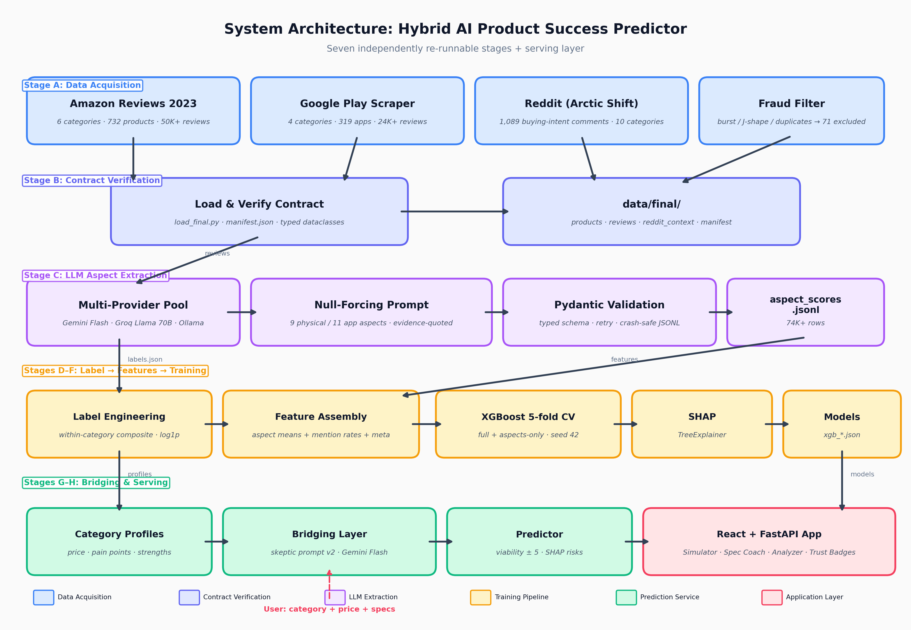
<figcaption>Pipeline overview: extraction, label engineering, feature
assembly, training, category profiling, and the bridging/prediction
service.</figcaption>
</figure>

# Validation {#sec:validation}

## Retrospective Launch-Blind Harness

The central validation question is counterfactual: *had our system
existed on the day a real product launched, would its specs-only
estimate have anticipated that product's eventual market outcome?* We
answer it retrospectively. From the 732 physical products we drew a
stratified sample of 90---three per (category $\times$ success-quintile)
cell---so that flops and hits are represented equally rather than in
their natural, success-skewed proportions.

For each sampled product, the bridging layer received only information
knowable at launch: name, brand, price, and the manufacturer's marketing
copy. Reviews, ratings, and sales signals were withheld. The bridged
profile was fed to the aspects-only model, and the resulting estimate
compared against the product's actual success score, computed from the
thousands of reviews it subsequently accumulated. One caveat is
disclosed rather than hidden: category profiles include each target
product's own reviews at approximately $1/130$ weight; we consider this
leakage negligible but note it.

On this 90-product development set the pipeline achieved Spearman
$\rho = 0.313$ ($p = 0.003$), Pearson $r = 0.361$, and a
flop-versus-monopoly AUC of 0.761---computed between the top and bottom
actual-success quintiles. Mean predicted viability rose monotonically
across all five quintiles ($59.1 \to 61.1 \to 61.4 \to 63.2 \to 65.7$),
a spread of 6.6 points.

## Pre-Registered Confirmatory Holdout

Every design decision above was tuned on the same 90 products, creating
a textbook overfitting risk. We therefore pre-registered a confirmatory
study (Nosek et al. 2018): before the confirmatory run, we drew 59
products disjoint from the development set (fixed seed), froze the
entire pipeline, and pre-specified the analysis. No tuning occurred
after the result was observed.

The holdout confirmed the development findings: $\rho = 0.317$
($p = 0.014$), bootstrap 95% CI $[0.059, 0.543]$ excluding zero; AUC
$= 0.743$, CI $[0.51, 0.93]$; tier means again strictly monotonic
($58.5 \to 60.8 \to 61.7 \to 62.8 \to 64.1$;
Fig. [5](#fig:holdout){reference-type="ref" reference="fig:holdout"}).
The point estimates land within a few thousandths of the development
values, the pattern expected of a real signal rather than a tuned
artifact. We treat this pre-registered replication as the paper's
primary evidence, and report the interval as prominently as the point
estimate: at $n = 59$, $\rho = 0.317$ explains on the order of 10% of
rank variance. This is a screening signal for portfolios of candidate
designs, not a verdict on any single product.

<figure id="fig:holdout" data-latex-placement="!t">
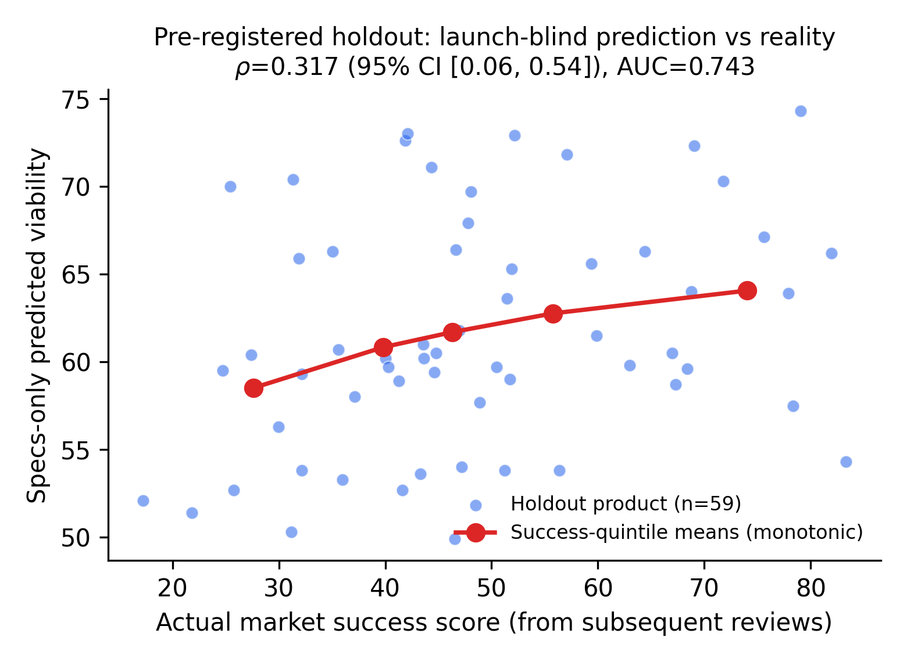
<figcaption>Pre-registered holdout (<em>n</em> = 59): specs-only predicted
viability versus actual market success, with monotonic success-quintile
means.</figcaption>
</figure>

## Baselines, Ablations, and Rejected Alternatives

A launch-blind correlation is only interesting if it is not a
rediscovery of something trivial. Three baselines use the same
launch-knowable inputs: price-distance from category median achieves
$\rho = -0.178$; marketing-copy length $\rho = -0.259$ (longer copy
weakly signals *worse* outcomes); and the strongest, within-category
price percentile, achieves $\rho = 0.250$. The full pipeline beats this
baseline only modestly on magnitude, but the two signals are nearly
orthogonal ($r = 0.135$): the pipeline is not re-deriving price
position, and a post-hoc rank ensemble of the two reaches $\rho = 0.320$
(exploratory).

Two ablations shaped the final system
(Fig. [6](#fig:ablation){reference-type="ref"
reference="fig:ablation"}). The adopted one is the skeptic prompt, which
raised $\rho$ from 0.241 to 0.313 and AUC from 0.653 to 0.761 on
identical products; partial correlation controlling for spec length
shows the lift is not a verbosity proxy ($\rho = 0.303$, $p = 0.004$).
The rejected one is validity-weighted shrinkage toward category means:
intuition strongly favored it; a leave-one-out evaluation showed it
*reduces* $\rho$ from 0.313 to 0.249, evidently by destroying
cross-aspect covariance the downstream model exploits. We report it as a
cautionary result: plausible calibration steps must be tested with
held-out weights before shipping.

<figure id="fig:ablation" data-latex-placement="!t">
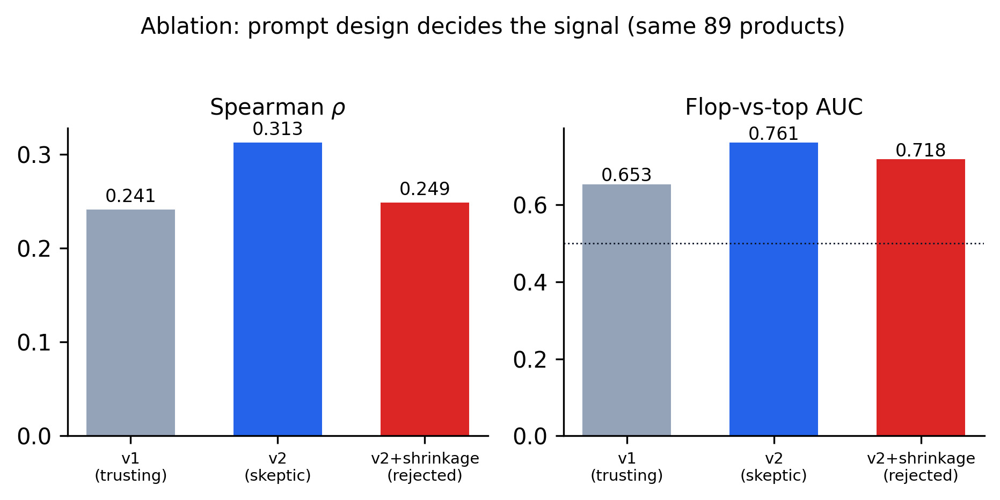
<figcaption>Ablation on identical products: trusting prompt (v1),
skeptic prompt (v2), and the rejected shrinkage variant.</figcaption>
</figure>

## Which Aspects Can Be Estimated from Specs

Per aspect, bridged estimates correlate with review-derived ground truth
at $r = 0.44$ $[0.23, 0.61]$ for ease of use, $0.40$ $[0.20, 0.58]$ for
build quality, $0.39$ for durability and reliability, $0.38$ for
utility, and $0.33$ for value for money. At the other extreme,
after-sales ($r = 0.05$ $[-0.18, 0.28]$) and design appeal ($r = 0.19$)
are effectively unestimable from specifications---service quality is
invisible in a spec sheet, and aesthetics are subjective in ways
category norms do not capture
(Fig. [7](#fig:validity){reference-type="ref"
reference="fig:validity"}). These measured tiers are surfaced verbatim
in the application as trust badges. Holdout per-aspect correlations
broadly reproduce the tiers (ease of use 0.53, utility 0.51), with one
deviation noted honestly: build quality dropped to $r = 0.13$ on the
holdout, flagged as an instability to investigate rather than smoothed
over.

<figure id="fig:validity" data-latex-placement="!t">
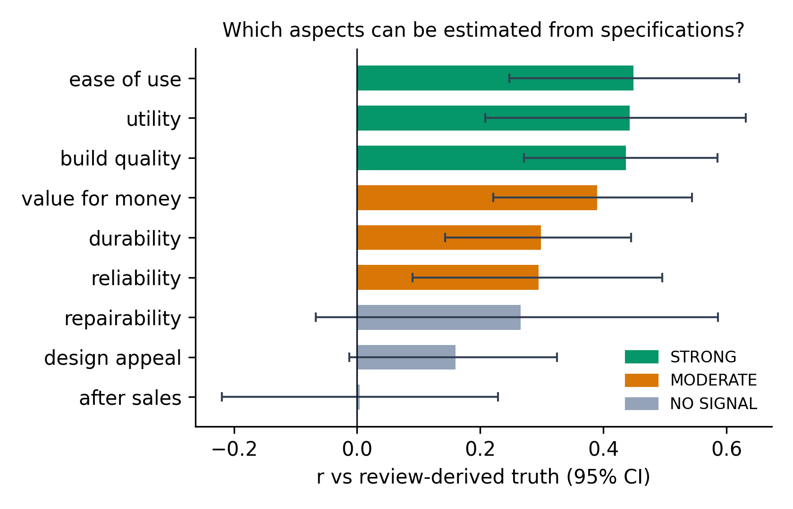
<figcaption>Per-aspect validity of bridged estimates (r with 95% CI),
colored by the trust tier shown to users.</figcaption>
</figure>

## Named-Product Spectrum

As a face-validity check, we examined the ranked spectrum by name. At
the top of the specs-only predictions sit products that in reality
accumulated 30,000--78,000 ratings (established Bose, JBL, and DOSS
lines); at the bottom, a smartwatch clone with a 2.9-star average. The
system, seeing nothing but launch copy, orders the extremes of the
market correctly---while the middle of the distribution remains noisy,
as the $\rho$ makes explicit.

# Negative Finding: The Mobile-App Track {#sec:negative}

The pipeline was designed symmetrically for physical products and mobile
applications, and for applications it fails---a result we report with
the same prominence as the successes. Against our pre-registered
acceptance gate (CV $R^2 \geq 0.35$ for the aspects-only model), the app
track scores $R^2 = 0.101$ ($n = 319$). The full model reaches
$R^2 = 0.889$, but only by leaning on install counts and rating
volume---post-launch popularity metadata a pre-production tool cannot
have.

The natural rescue hypothesis is that the *target* is at fault: our
composite weights installs and velocity at 50%, and those are
distribution outcomes---marketing spend, store placement, network
effects---that product quality cannot see. If so, review aspects should
still predict quality-side outcomes. We tested this directly, retraining
the identical aspects-only model against five outcome definitions under
the same cross-validation: the composite ($R^2 = 0.101$), average rating
(0.153), a retention proxy ($-0.012$), normalized installs (0.231), and
review velocity (0.072). None approaches the gate
(Fig. [8](#fig:apptargets){reference-type="ref"
reference="fig:apptargets"}); most strikingly, review aspects cannot
even predict an app's *own average rating*. The failure is therefore not
a target-definition artifact but something more fundamental: app-store
ratings are compressed into a narrow 4.0--4.6 band, the categories
studied are dominated by free apps whose review sentiment orbits
monetization and advertising rather than durable quality, and success is
distribution-driven end to end.

We draw two conclusions. Methodologically, the framework functions as an
instrument for discovering *which* market outcomes are learnable from
quality signals---physical-product success partially is; app-store
success, under any definition we tested, is not. Practically, we retired
the app track from the tool's user-facing surface: the option remains
visible but disabled, with the experiment cited, because silently
deleting a failed track would misrepresent the scope of what was
attempted.

<figure id="fig:apptargets" data-latex-placement="!t">
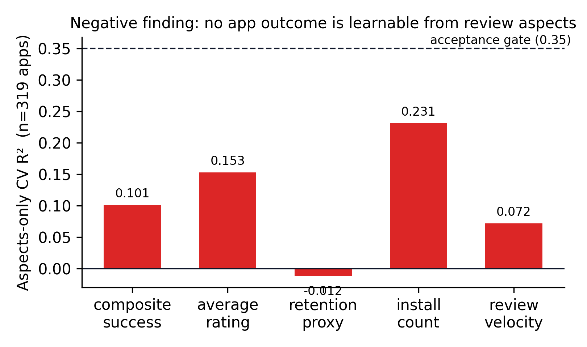
<figcaption>Five-target sweep for mobile applications: no outcome
definition is learnable from review aspects.</figcaption>
</figure>

# Exploratory: Community Priors {#sec:reddit}

Category profiles ground the bridging prompt in review-derived
statistics, but reviews describe products people already bought;
community discussions capture what buyers *wish they had known*. We
collected 1,089 buying-intent comments across all ten categories
(Section [3](#sec:data){reference-type="ref" reference="sec:data"}),
summarized each category's consumer priorities with a single LLM call,
and injected the summary into the bridging prompt.

The effect was measured with a paired A/B: the same 89 development
products were each bridged twice with the same provider and seed,
differing only in the presence of the priorities field. With priorities,
$\rho$ rose from 0.311 to 0.359 and AUC from 0.728 to 0.752. However,
the paired bootstrap 95% CI on the $\rho$ difference is
$[-0.025, +0.125]$, which includes zero: **we report the lift as
suggestive, not confirmed.** Unlike the holdout of
Section [5](#sec:validation){reference-type="ref"
reference="sec:validation"}, this comparison was not pre-registered. Two
observations contextualize the result: the without-priorities arm
independently reproduces the original baseline (0.311 vs. 0.313),
indicating the harness is stable; and the input was small---a thousand
comments, with tails as thin as 18 comments for smartphones---so if the
effect is real, its data-efficiency would be notable. Confirming it,
ideally with a pre-registered replication on the holdout set, is future
work.

# System {#sec:system}

The pipeline is implemented as seven independently re-runnable stages
(Fig. [4](#fig:pipeline){reference-type="ref"
reference="fig:pipeline"}). Each stage writes its output to disk and
never repeats expensive work unless forced; the extraction stage is
crash-safe and resumable, which mattered in practice---the full batch
spans days of rate-limited API calls across a rotating provider pool.
Feature manifests are serialized to disk and prediction code constructs
input vectors by iterating them, so the serving path can never silently
misalign with training. A single end-to-end smoke test regenerates
synthetic data and runs every stage in a sandbox; it gates every code
change.

The user-facing application (Fig. [9](#fig:ui){reference-type="ref"
reference="fig:ui"}a) is a React front end served by a FastAPI backend.
A founder describes a product---category, price, and free-text
specifications---and receives the full analysis: a viability range
(deliberately $\pm 5$ wide), a percentile rank against the 90
retrospectively bridged real products, per-aspect estimates plotted
against category averages, SHAP-derived (Lundberg and Lee 2017) top
risks and strengths phrased in terms of design levers the founder
controls, and a market-gap report quoting verbatim customer complaints
for category pain points the design does not convincingly address. Every
aspect estimate carries its trust badge and grounding flag; when at
least half the aspects are ungrounded, an abstention banner replaces
confidence with a redirect to the spec coach.

The spec coach (Fig. [9](#fig:ui){reference-type="ref"
reference="fig:ui"}b) closes the loop for users who are not skilled spec
writers. One LLM call classifies the draft's coverage of each aspect
(covered / vague / missing), asks at most five questions ordered by how
much their answers would sharpen the prediction---prioritizing aspects
that are both missing and top category pain points---and rewrites the
spec preserving every stated fact while inserting explicit placeholders
for missing decisions. The coach is constitutionally forbidden from
inventing materials, numbers, or features the user did not state.

Finally, the model-performance view
(Fig. [9](#fig:ui){reference-type="ref" reference="fig:ui"}c) renders
the training report directly from its JSON artifact---including the
mobile-application aspects-only row with its FAIL badge. Surfacing the
system's own failed benchmark in the product UI, alongside the disabled
app-track option, is a deliberate design position consonant with calls
for calibrated autonomy in AI-assisted decisions (Cristofaro and
Bañón-Gomis 2026): a decision-support tool earns trust by displaying the
boundaries of its competence as prominently as its successes.

<figure id="fig:ui" data-latex-placement="!t">

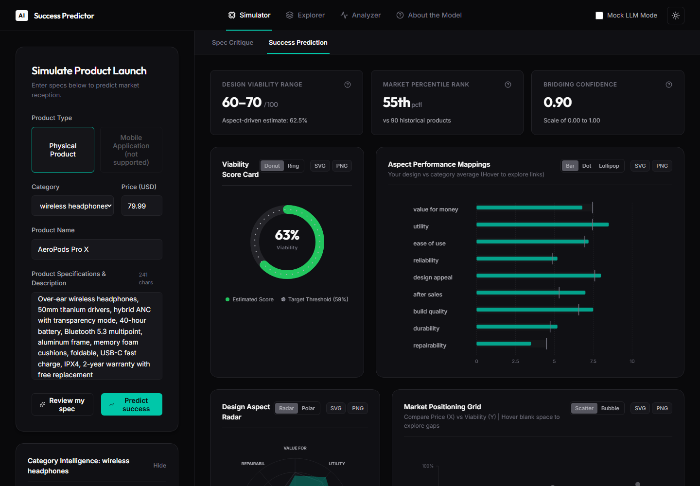 
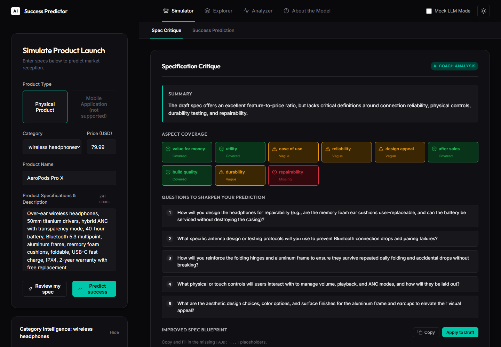 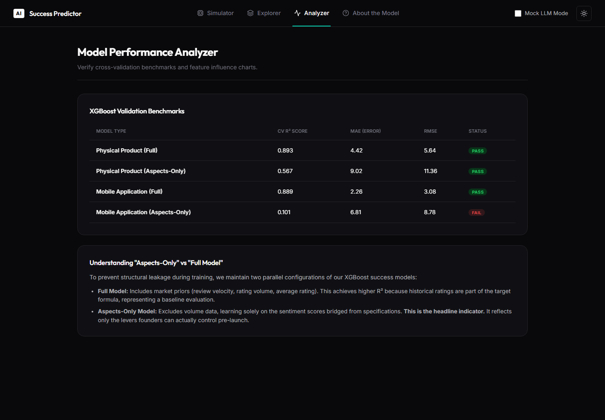

<figcaption>The application. (a) Prediction dashboard with viability
range, percentile rank, aspect-vs-category chart, and the disabled app
track. (b) Spec coach. (c) Analyzer view showing the honest benchmark
table including the failed app-track gate.</figcaption>
</figure>

# Limitations {#sec:limitations}

**Survivorship bias is the most important limitation and bounds every
claim in this paper.** Our corpus requires at least five reviews per
product, so products that launched and attracted no attention---arguably
the truest flops---are structurally absent. All results concern ranking
among products that reached the market's attention. The system's ability
to identify products that would fail to gain any traction whatsoever is
untested and untestable with this data.

Second, statistical power: the holdout has $n = 59$; its CI is
compatible with a weak-to-moderate true effect, and $\rho \approx 0.32$
explains roughly 10% of rank variance. The appropriate use is screening
many candidate designs, not adjudicating a single launch. Third, scope:
validated claims cover six physical categories only; the app track
failed all five outcome definitions tested; the Reddit lift is
unconfirmed. Fourth, our "specifications" are launch-day marketing
copy---the closest launch-knowable proxy available retrospectively, but
not identical to pre-production engineering specs, and adversarially
optimistic in ways the skeptic prompt mitigates but cannot eliminate.
Fifth, the pipeline depends on hosted LLMs: prompts and seeds are
frozen, but provider models evolve, so exact reproduction requires the
archived extraction outputs published with the code. Finally, review
text is a gameable signal; our fraud filter excluded 71 suspect
products, but sophisticated manipulation (Mayzlin et al. 2014) would
pass it.

# Conclusion

We asked whether a product's market fate can be partially read from its
specifications alone, before any consumer has touched it. The answer,
within carefully stated bounds, is yes: an LLM that extracts aspect
sentiment from 74,000 reviews, a gradient-boosted model that learns
which aspect profiles succeed, and a skeptic-prompted bridging layer
that estimates those profiles from specs combine into a launch-blind
signal of $\rho = 0.317$ (CI $[0.06, 0.54]$) against real market
outcomes---confirmed on a pre-registered holdout, nearly orthogonal to
price, and monotonic across success tiers from flops to category
leaders.

The contribution we consider most durable is not the point estimate but
the map: which aspects specifications can predict (ease of use, utility,
build quality), which they cannot (after-sales service, aesthetics), and
which markets the method works in at all (physical goods, where quality
is rewarded) versus where it fails under every outcome definition tested
(app stores, where distribution dominates). For the small businesses
that motivated this work, such a map is the difference between an oracle
they should not trust and an instrument they can: a pre-production
screen that improves the odds that the money they invest produces
products their users find worth paying for. A tool that knows and
displays its own limits---trust badges, abstention, uncertainty
ranges---is, we argue, the only honest form such a tool can take at the
current state of the art.

::::::::::::::::::::::::::::::::::::::::::::::::::::::: {#refs .references .csl-bib-body .hanging-indent}
::: {#ref-archak2011deriving .csl-entry}
Archak, Nikolay, Anindya Ghose, and Panagiotis G. Ipeirotis. 2011.
"Deriving the Pricing Power of Product Features by Mining Consumer
Reviews." *Management Science* 57 (8): 1485--509.
:::

::: {#ref-asur2010predicting .csl-entry}
Asur, Sitaram, and Bernardo A. Huberman. 2010. "Predicting the Future
with Social Media." *Proc. IEEE/WIC/ACM Int. Conf. On Web Intelligence*,
492--99.
:::

::: {#ref-baumgartner2020pushshift .csl-entry}
Baumgartner, Jason, Savvas Zannettou, Brian Keegan, Megan Squire, and
Jeremy Blackburn. 2020. "The Pushshift Reddit Dataset." *Proc. Int. AAAI
Conf. On Web and Social Media (ICWSM)* 14: 830--39.
:::

::: {#ref-bommasani2021foundation .csl-entry}
[Bommasani, Rishi, Drew A. Hudson, Ehsan Adeli, et al.]{.nocase} 2021.
"On the Opportunities and Risks of Foundation Models." *arXiv Preprint
arXiv:2108.07258*.
:::

::: {#ref-breiman2001random .csl-entry}
Breiman, Leo. 2001. "Random Forests." *Machine Learning* 45 (1): 5--32.
:::

::: {#ref-brown2020gpt3 .csl-entry}
[Brown, Tom B., Benjamin Mann, Nick Ryder, Melanie Subbiah, et
al.]{.nocase} 2020. "Language Models Are Few-Shot Learners." *Advances
in Neural Information Processing Systems* 33: 1877--901.
:::

::: {#ref-chen2016xgboost .csl-entry}
Chen, Tianqi, and Carlos Guestrin. 2016. "XGBoost: A Scalable Tree
Boosting System." *Proc. ACM SIGKDD Int. Conf. On Knowledge Discovery
and Data Mining*, 785--94.
:::

::: {#ref-chevalier2006wom .csl-entry}
Chevalier, Judith A., and Dina Mayzlin. 2006. "The Effect of Word of
Mouth on Sales: Online Book Reviews." *Journal of Marketing Research* 43
(3): 345--54.
:::

::: {#ref-chintagunta2010effects .csl-entry}
Chintagunta, Pradeep K., Shyam Gopinath, and Sriram Venkataraman. 2010.
"The Effects of Online User Reviews on Movie Box Office Performance."
*Marketing Science* 29 (5): 944--57.
:::

::: {#ref-cortes1995svm .csl-entry}
Cortes, Corinna, and Vladimir Vapnik. 1995. "Support-Vector Networks."
*Machine Learning* 20 (3): 273--97.
:::

::: {#ref-cristofaro2026dancing .csl-entry}
Cristofaro, Matteo, and Alexis J. Bañón-Gomis. 2026. "Dancing with the
Algorithm: A Framework to Navigate Knowledge and Autonomy in AI-Assisted
Managerial Decisions." *Journal of Knowledge Management* 30 (11).
<https://doi.org/10.1108/JKM-06-2025-0870>.
:::

::: {#ref-dellarocas2003digitization .csl-entry}
Dellarocas, Chrysanthos. 2003. "The Digitization of Word of Mouth:
Promise and Challenges of Online Feedback Mechanisms." *Management
Science* 49 (10): 1407--24.
:::

::: {#ref-devlin2019bert .csl-entry}
Devlin, Jacob, Ming-Wei Chang, Kenton Lee, and Kristina Toutanova. 2019.
"BERT: Pre-Training of Deep Bidirectional Transformers for Language
Understanding." *Proc. NAACL-HLT*, 4171--86.
:::

::: {#ref-efron1979bootstrap .csl-entry}
Efron, Bradley. 1979. "Bootstrap Methods: Another Look at the
Jackknife." *Annals of Statistics* 7 (1): 1--26.
:::

::: {#ref-friedman2001greedy .csl-entry}
Friedman, Jerome H. 2001. "Greedy Function Approximation: A Gradient
Boosting Machine." *Annals of Statistics* 29 (5): 1189--232.
:::

::: {#ref-gemini2023 .csl-entry}
Gemini Team, Google. 2023. "Gemini: A Family of Highly Capable
Multimodal Models." *arXiv Preprint arXiv:2312.11805*.
:::

::: {#ref-ghose2011estimating .csl-entry}
Ghose, Anindya, and Panagiotis G. Ipeirotis. 2011. "Estimating the
Helpfulness and Economic Impact of Product Reviews: Mining Text and
Reviewer Characteristics." *IEEE Transactions on Knowledge and Data
Engineering* 23 (10): 1498--512.
:::

::: {#ref-gilardi2023chatgpt .csl-entry}
Gilardi, Fabrizio, Meysam Alizadeh, and Maël Kubli. 2023. "ChatGPT
Outperforms Crowd Workers for Text-Annotation Tasks." *Proceedings of
the National Academy of Sciences* 120 (30).
:::

::: {#ref-grinsztajn2022tree .csl-entry}
Grinsztajn, Léo, Edouard Oyallon, and Gaël Varoquaux. 2022. "Why Do
Tree-Based Models Still Outperform Deep Learning on Typical Tabular
Data?" *Advances in Neural Information Processing Systems* 35.
:::

::: {#ref-gutierrez2025zeroshot .csl-entry}
Gutierrez, Bruno, Jonatas Grosman, Fernando A. Correia, and Hélio Lopes.
2025. "Zero-Shot Product Description Generation from Customers Reviews."
*Proc. Int. Conf. On Agents and Artificial Intelligence (ICAART)*.
<https://doi.org/10.5220/0013280300003929>.
:::

::: {#ref-he2016ups .csl-entry}
He, Ruining, and Julian McAuley. 2016. "Ups and Downs: Modeling the
Visual Evolution of Fashion Trends with One-Class Collaborative
Filtering." *Proc. Int. Conf. On World Wide Web (WWW)*, 507--17.
:::

::: {#ref-hidayat2025custody .csl-entry}
Hidayat, Fiki, Arbi Haza Nasution, Fajril Ambia, Dike Fitriansyah Putra,
and Mulyandri. 2025. "Leveraging Large Language Models for Discrepancy
Value Prediction in Custody Transfer Systems: A Comparative Analysis of
Probabilistic and Point Forecasting Approaches." *IEEE Access* 13.
<https://doi.org/10.1109/ACCESS.2025.3560254>.
:::

::: {#ref-hoerl1970ridge .csl-entry}
Hoerl, Arthur E., and Robert W. Kennard. 1970. "Ridge Regression: Biased
Estimation for Nonorthogonal Problems." *Technometrics* 12 (1): 55--67.
:::

::: {#ref-hou2024amazon .csl-entry}
Hou, Yupeng, Jiacheng Li, Zhankui He, An Yan, Xiusi Chen, and Julian
McAuley. 2024. "Bridging Language and Items for Retrieval and
Recommendation." *arXiv Preprint arXiv:2403.03952*.
:::

::: {#ref-hu2004mining .csl-entry}
Hu, Minqing, and Bing Liu. 2004. "Mining and Summarizing Customer
Reviews." *Proc. ACM SIGKDD Int. Conf. On Knowledge Discovery and Data
Mining*, 168--77.
:::

::: {#ref-jindal2008opinion .csl-entry}
Jindal, Nitin, and Bing Liu. 2008. "Opinion Spam and Analysis." *Proc.
Int. Conf. On Web Search and Data Mining (WSDM)*, 219--30.
:::

::: {#ref-ke2017lightgbm .csl-entry}
Ke, Guolin, Qi Meng, Thomas Finley, et al. 2017. "LightGBM: A Highly
Efficient Gradient Boosting Decision Tree." *Advances in Neural
Information Processing Systems* 30.
:::

::: {#ref-lange2025curriculum .csl-entry}
Lange, Nana, Flavius Frasincar, and Maria Mihaela Truşcă. 2025.
"Curriculum Learning for a Hybrid Approach for Aspect-Based Sentiment
Analysis." *Expert Systems with Applications*, ahead of print.
<https://doi.org/10.1016/j.eswa.2025.129669>.
:::

::: {#ref-liu2012sentiment .csl-entry}
Liu, Bing. 2012. *Sentiment Analysis and Opinion Mining*. Morgan &
Claypool.
:::

::: {#ref-luca2016reviews .csl-entry}
Luca, Michael. 2016. "Reviews, Reputation, and Revenue: The Case of
Yelp.com." *Harvard Business School Working Paper 12-016*.
:::

::: {#ref-lundberg2017shap .csl-entry}
Lundberg, Scott M., and Su-In Lee. 2017. "A Unified Approach to
Interpreting Model Predictions." *Advances in Neural Information
Processing Systems* 30.
:::

::: {#ref-mayzlin2014promotional .csl-entry}
Mayzlin, Dina, Yaniv Dover, and Judith Chevalier. 2014. "Promotional
Reviews: An Empirical Investigation of Online Review Manipulation."
*American Economic Review* 104 (8): 2421--55.
:::

::: {#ref-mudambi2010helpful .csl-entry}
Mudambi, Susan M., and David Schuff. 2010. "What Makes a Helpful Online
Review? A Study of Customer Reviews on Amazon.com." *MIS Quarterly* 34
(1): 185--200.
:::

::: {#ref-narayanan2020prelaunch .csl-entry}
Narayanan, Sandhya, Philip Samuel, and Mariamma Chacko. 2020. "Product
Pre-Launch Prediction from Resilient Distributed e-WOM Data." *IEEE
Access* 8. <https://doi.org/10.1109/ACCESS.2020.3023346>.
:::

::: {#ref-nosek2018preregistration .csl-entry}
Nosek, Brian A., Charles R. Ebersole, Alexander C. DeHaven, and David T.
Mellor. 2018. "The Preregistration Revolution." *Proceedings of the
National Academy of Sciences* 115 (11): 2600--2606.
:::

::: {#ref-openai2023gpt4 .csl-entry}
OpenAI. 2023. "GPT-4 Technical Report." *arXiv Preprint
arXiv:2303.08774*.
:::

::: {#ref-ott2011deceptive .csl-entry}
Ott, Myle, Yejin Choi, Claire Cardie, and Jeffrey T. Hancock. 2011.
"Finding Deceptive Opinion Spam by Any Stretch of the Imagination."
*Proc. Annual Meeting of the ACL*, 309--19.
:::

::: {#ref-ouyang2022instruct .csl-entry}
[Ouyang, Long, Jeff Wu, Xu Jiang, et al.]{.nocase} 2022. "Training
Language Models to Follow Instructions with Human Feedback." *Advances
in Neural Information Processing Systems* 35.
:::

::: {#ref-pontiki2014semeval .csl-entry}
Pontiki, Maria, Dimitris Galanis, John Pavlopoulos, Harris Papageorgiou,
Ion Androutsopoulos, and Suresh Manandhar. 2014. "SemEval-2014 Task 4:
Aspect Based Sentiment Analysis." *Proc. 8th Int. Workshop on Semantic
Evaluation (SemEval)*, 27--35.
:::

::: {#ref-rakee2025temul .csl-entry}
Rakee, Fatemeh, Ali Hamzeh, and Niloofar Mozafari. 2025. "TEMUL:
Tensor-Based Deep Learning Approach for Multi-Criteria Recommender
System." *IEEE Access* 13.
<https://doi.org/10.1109/ACCESS.2025.3626692>.
:::

::: {#ref-sesr2025multisource .csl-entry}
"Research on Sentiment Analysis Based on Multi-Source Data Fusion."
2025. *Socio-Economic Statistics Research* 6 (2): 89--98.
<https://doi.org/10.38007/SESR.2025.060209>.
:::

::: {#ref-roumeliotis2025llms .csl-entry}
Roumeliotis, Konstantinos I., Nikolaos D. Tselikas, and Dimitrios
Nasiopoulos. 2025. "LLMs for Product Classification in e-Commerce: A
Zero-Shot Comparative Study of GPT and Claude Models." *Natural Language
Processing Journal* 11: 100142.
<https://doi.org/10.1016/j.nlp.2025.100142>.
:::

::: {#ref-sayyad2024catboost .csl-entry}
Sayyad, Javed K., Khush Attarde, and Nasreddine Saadouli. 2024.
"Optimizing e-Commerce Supply Chains with Categorical Boosting: A
Predictive Modeling Framework." *IEEE Access* 12.
<https://doi.org/10.1109/ACCESS.2024.3447756>.
:::

::: {#ref-shan2025bilingual .csl-entry}
Shan, Shizhong, Jin Sun, and Remson Mark C. Macawile. 2025. "Examining
Customer Satisfaction Through Transformer-Based Sentiment Analysis for
Improving Bilingual e-Commerce Experiences." *IEEE Access* 13.
<https://doi.org/10.1109/ACCESS.2025.3551666>.
:::

::: {#ref-shang2025bitcoin .csl-entry}
Shang, Lei. 2025. "Sentiment-Driven Bitcoin Price Range Forecasting:
Enhancing CART Decision Trees with High-Dimensional Indicators and
Twitter Dynamics." *IEEE Access* 13.
<https://doi.org/10.1109/ACCESS.2025.3557186>.
:::

::: {#ref-shwartzziv2022tabular .csl-entry}
Shwartz-Ziv, Ravid, and Amitai Armon. 2022. "Tabular Data: Deep Learning
Is Not All You Need." *Information Fusion* 81: 84--90.
:::

::: {#ref-touvron2023llama .csl-entry}
[Touvron, Hugo, Thibaut Lavril, Gautier Izacard, et al.]{.nocase} 2023.
"LLaMA: Open and Efficient Foundation Language Models." *arXiv Preprint
arXiv:2302.13971*.
:::

::: {#ref-vaswani2017attention .csl-entry}
Vaswani, Ashish, Noam Shazeer, Niki Parmar, et al. 2017. "Attention Is
All You Need." *Advances in Neural Information Processing Systems* 30.
:::

::: {#ref-wang2025multifeature .csl-entry}
Wang, Jiaofeng, Hongfang Gong, and Xinyu Guo. 2025. "MultiFeature Fusion
Graph Attention Network for Aspect-Based Sentiment Analysis."
*Knowledge-Based Systems*, ahead of print.
<https://doi.org/10.1016/j.knosys.2025.114084>.
:::

::: {#ref-wei2022chain .csl-entry}
Wei, Jason, Xuezhi Wang, Dale Schuurmans, et al. 2022. "Chain-of-Thought
Prompting Elicits Reasoning in Large Language Models." *Advances in
Neural Information Processing Systems* 35.
:::

::: {#ref-zhang2022survey .csl-entry}
Zhang, Wenxuan, Xin Li, Yang Deng, Lidong Bing, and Wai Lam. 2023. "A
Survey on Aspect-Based Sentiment Analysis: Tasks, Methods, and
Challenges." *IEEE Transactions on Knowledge and Data Engineering* 35
(11): 11019--38.
:::

::: {#ref-zhen2025stock .csl-entry}
Zhen, Kehan, Dan Xie, and Xiaochun Hu. 2025. "A Multi-Feature Selection
Fused with Investor Sentiment for Stock Price Prediction." *Expert
Systems with Applications*, ahead of print.
<https://doi.org/10.1016/j.eswa.2025.127381>.
:::
:::::::::::::::::::::::::::::::::::::::::::::::::::::::

[^1]: R. Jagtap is an undergraduate student of Computer Science and
    Engineering. This work was completed as a final-year capstone
    project, 2026.
